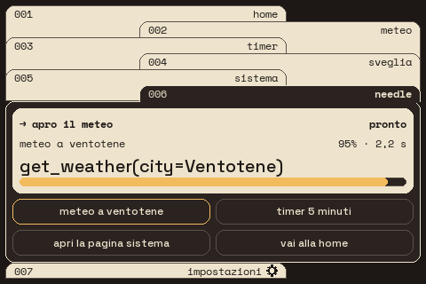
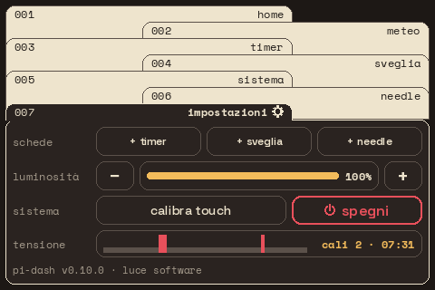
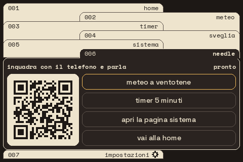

# PiDash

> Versione 0.10.0 · 2026-10-03

Cruscotto da tavolo per Raspberry Pi con schermo touch SPI da 3,5": ora, meteo con vento in nodi,
timer di partenza regata, sveglia e stato del sistema, in un'interfaccia a schedario ispirata ai
computer di bordo. Si comanda anche a voce dal telefono, con un modello locale che avvia timer e
sveglie e accende le luci Philips Hue.

[](https://github.com/Hapoyo/PiDash/actions/workflows/test.yml)


> **In English** — PiDash is a desk dashboard for a Raspberry Pi 3 with a 3.5" SPI touch display
> (480×320, ILI9486). It shows the time, weather with wind in knots, a regatta start timer,
> alarms and system stats, laid out as a filing cabinet of tabs. It draws straight to the
> framebuffer, so no desktop is needed, and Pillow is its only dependency. A Settings tab adds
> or removes tabs, sets the brightness, calibrates the touch screen, shuts the Pi down and warns
> when the supply voltage drops below 4.63 V. Location comes from GPS, nearby Wi-Fi networks or
> the IP address. An optional Needle tab runs a small local function-calling model: Italian
> phrases, typed on screen or spoken into a phone through a push-to-talk page reached by QR
> code, start timers, set alarms, open pages and drive Philips Hue lights. The on-screen text and the documentation below are in Italian; installation
> is covered in [section 4](#4-installazione).

## 1. Caratteristiche

- **Schedario componibile**: ogni funzione è una cartella con la sua linguetta; timer e sveglia si
  aggiungono e si tolgono direttamente dallo schermo, dalle **Impostazioni** (linguetta con
  l'ingranaggio), dove si regolano anche luminosità e calibrazione del tocco e si spegne il Pi.
- **Tocco preciso**: ogni bottone risponde da solo, un tocco appena fuori vale per il più vicino,
  il punto è la mediana dei campioni letti mentre il dito preme.
- **Meteo per chi va in mare**: vento in nodi con direzione, raffiche e forza Beaufort, pressione,
  pioggia e previsione a 15 ore da [Open-Meteo](https://open-meteo.com), senza chiave API.
- **Timer di partenza regata**: il tempo si compone sommando i bottoni (+1′, +5′, +10′, +15′,
  −1′, C per azzerare); **sveglie settimanali**.
- **Needle, comandi in italiano**: scheda opzionale con il modello locale
  [Needle](https://github.com/cactus-compute/needle) (function calling, 35 MB, senza rete) e un
  interprete di frasi che capisce da solo timer, sveglie e luci ("timer un quarto d'ora",
  "svegliami alle 7 nei giorni feriali", "luce calda in soggiorno"). Azioni personalizzate: una
  parola ("buonanotte") avvia insieme timer, sveglia, luci e pagina. Un bot animato mostra lo stato.
- **Parla dal telefono**: un tocco sul bot mostra un QR; il telefono apre una pagina "premi e
  parla" in HTTPS, riconosce la voce e manda al Pi solo il testo. Protetta da un codice d'accesso
  creato al primo avvio.
- **Luci Philips Hue**: accendere, spegnere, regolare luminosità, colore e temperatura di una
  stanza o di tutta la casa, con controlli che impediscono di scambiare "accendi" e "spegni".
- **Posizione precisa**: GPS se c'è un ricevitore, altrimenti le reti Wi-Fi vicine, poi l'IP.
- **Controllo dell'alimentazione**: grafico degli ultimi 48 minuti e avviso in rosa quando la
  tensione in ingresso scende sotto 4,63 V (rilevatore di sottotensione del Raspberry).
- **Funziona anche senza rete**: alba e tramonto calcolati in locale, ultimo meteo in cache.
- **Motion graphics leggere**: sequenza di accensione, transizioni, cifre che si decodificano,
  pensate per il bus SPI (si aggiornano solo le righe cambiate).
- **Nessun desktop richiesto**: disegna direttamente nel framebuffer su Raspberry Pi OS Lite.
- **Aggiornamento con un comando**, con test e ritorno automatico alla versione precedente.
- **Cambio di rete Wi-Fi da SSH** con un comando (`--wifi`), senza riscrivere la microSD.
- **Una sola dipendenza Python**: Pillow.

## 2. Schermate

| # | Pagina | Presente | Contenuto |
|---|---|---|---|
| 001 | Home | sempre | ora e data, luogo e coordinate, alba/tramonto, avanzamento del giorno, anelli di settimana, mese e anno |
| 002 | Meteo | sempre | temperatura, vento (nodi, direzione, raffiche, Beaufort), pioggia, umidità, pressione, previsione oraria, fase lunare |
| 003 | Timer | a scelta | conto alla rovescia composto con i bottoni; 5′ = sequenza di partenza |
| 004 | Sveglia | a scelta | prossima sveglia, stato, sveglie per giorno della settimana |
| 005 | Sistema | sempre | CPU, RAM, disco, storici di CPU e rete, host, IP, temperatura, uptime |
| 006 | Needle | a scelta | modello locale [Needle](https://github.com/cactus-compute/needle) (function calling): esito dell'ultima frase, bot che mostra lo stato del modello, bottoni con le frasi da provare; esegue timer, sveglie, pagine e luci Philips Hue; un tocco sul bot mostra il QR della pagina "premi e parla" |
| ⚙ | Impostazioni | sempre | schede opzionali, luminosità, calibrazione del tocco, spegnimento, grafico della tensione di alimentazione |

| 001 · Home | 002 · Meteo |
|:---:|:---:|
|  |  |
| **003 · Timer** | **004 · Sveglia** |
|  |  |
| **005 · Sistema** | **006 · Needle** |
|  |  |
| **⚙ · Impostazioni** | |
|  | |

Schermate fuori dallo schedario:

| Avvio (5 s, un tocco lo salta) | Spegni: il primo tocco chiede conferma |
|:---:|:---:|
|  |  |
| **Tensione sotto 4,63 V: grafico e linguetta in rosa** | **Calibra touch: quattro croci, una alla volta** |
|  |  |
| **Spegnimento** | **Needle: tocco sul bot, QR per il telefono** |
|  |  |

Immagini a 480×320, risoluzione nativa dello schermo, generate dal codice con dati dimostrativi
(l'indirizzo nel QR è d'esempio).

## 3. Requisiti

| Componente | Specifica |
|---|---|
| Scheda | Raspberry Pi 3 Model B, Raspberry Pi OS Lite 64 bit |
| Schermo | "3.5inch RPi Display" 480×320, controller ILI9486, touch XPT2046 (overlay `piscreen,drm`) |
| Alimentatore | 5,1 V · 2,5 A |
| Opzionali | pulsanti fisici su GPIO 5/13/19, cicalino su GPIO 26, ricevitore GPS USB |
| Software | Python ≥ 3.11, Pillow ≥ 10.1; `openssl` per la pagina "premi e parla" in HTTPS (di norma già installato) |
| Needle (facoltativo) | servizio [Needle](https://github.com/cactus-compute/needle) sul Pi (75 MB di RAM, ~2 s a frase); per la voce un telefono con Chrome o Safari sulla stessa rete; per le luci un bridge Philips Hue |
| Rete | facoltativa: serve per meteo e posizione, non per ora, alba e tramonto |

Collegamenti, overlay e banda del bus SPI: [docs/hardware.md](docs/hardware.md).

## 4. Installazione

Guida completa passo per passo, anche per chi usa un Raspberry per la prima volta:
[docs/installazione.md](docs/installazione.md). In sintesi, sul Raspberry:

```bash
sudo apt install -y git python3-venv python3-pil
git clone -b main https://github.com/Hapoyo/PiDash.git ~/pi-dash
cd ~/pi-dash
python3 -m venv --system-site-packages .venv
.venv/bin/pip install -r requirements.txt
.venv/bin/python -m dash --once --demo --driver sim   # prova: scrive out/frame.png
scripts/installa-servizio.sh && sudo systemctl start pi-dash
```

Facoltativi, con la guida: Needle (§ 5.9), luci Hue (§ 5.10), voce dal telefono (§ 5.13), cambio
di rete Wi-Fi (§ 3.1).

### 4.1 Aggiornamento

```bash
~/pi-dash/scripts/aggiorna.sh
```

Lo script scarica la nuova versione, aggiorna le dipendenze, esegue i test e riavvia il servizio.
Se un controllo fallisce ripristina da solo la versione precedente. Passaggio da un'installazione
copiata a mano: guida, § 7.1.

## 5. Configurazione

La configurazione è su due livelli:

- `config.json`, nel repository: i valori del progetto;
- `config.local.json`, solo sul Raspberry e fuori da Git: le impostazioni personali. Contiene solo
  le voci da cambiare, ha la precedenza e non viene toccato dagli aggiornamenti.

| Voce | Significato | Predefinito |
|---|---|---|
| `location.mode` | posizione: `auto` (GPS, poi Wi-Fi, poi IP), `ip`, `city` (per nome), `fixed` (coordinate) | `auto` |
| `location.name`, `lat`, `lon` | luogo e coordinate di riserva | Gaeta, 41,214 N 13,571 E |
| `location.wifi`, `gps_device` | posizione dalle reti Wi-Fi (BeaconDB); seriale del GPS | `true`; automatica |
| `timer.presets_s`, `timer.labels` | bottoni che sommano il tempo (secondi) ed etichette | 60, 300, 600, 900 · 300 = "partenza" |
| `backlight.level`, `backlight.mode` | luminosità 10–100; `auto`, `hw` (LED), `sw` (immagine) | 100, `auto` |
| `alarm.alarms` | sveglie: ora, giorni (0 = lunedì), attiva | 07:00, lunedì–venerdì |
| `needle.url`, `needle.queries` | servizio Needle locale e frasi dei bottoni (1–6); `needle.reset`: ogni frase è indipendente; `needle.timeout_s`: attesa massima della risposta | `http://127.0.0.1:8090`, 4 frasi, `true`, 15 s |
| `needle.regole`, `needle.azioni` | timer, sveglie e luci capiti dal codice (senza modello); azioni personalizzate: frasi chiave che avviano timer, sveglia, luci e pagina | `true`, 3 esempi |
| `needle.esegui`, `soglia`, `soglia_pagine`, `soglia_luci`, `naviga` | esegue le funzioni riconosciute; confidenza minima per timer e sveglia, per le sole pagine, per le luci; apre la pagina interessata | `true`, 0,6, 0,35, 0,4, `true` |
| `voce.porta`, `voce.token`, `voce.cert`, `voce.key` | pagina "premi e parla" per il telefono (HTTPS, guida § 5.13); codice d'accesso (solo in `config.local.json`); certificato proprio (vuoto = autofirmato) | 8443 in `config.json` (0 = spenta); codice creato al primo avvio |
| `hue.bridge`, `hue.key`, `hue.timeout_s` | bridge Philips Hue: indirizzo, chiave (solo in `config.local.json`, la scrive `--hue-registra`), attesa massima | vuoti, 2 s |
| `motion.livello`, `motion.fps` | animazioni: `pieno`, `eventi`, `off`; fotogrammi al secondo | `pieno`, 8 |
| `theme.palette` | colori dell'interfaccia, per nome (`orange`, `amber`…) | tema originale |
| `input.touch` | calibrazione del tocco (Impostazioni → calibra touch) | automatica |
| `display.rotate` | rotazione dell'immagine: 0, 90, 180, 270 | 0 |
| `new.tipi` | schede opzionali offerte dalle Impostazioni | `timer`, `alarm`, `needle` |

Esempio di `config.local.json`:

```json
{
  "location": {"mode": "fixed", "name": "Ventotene", "lat": 40.796, "lon": 13.436},
  "motion": {"livello": "eventi"}
}
```

Timer, sveglia e Needle si aggiungono dalle **Impostazioni** con un tocco sulla voce (coi pulsanti: B
sceglie, A conferma). Luminosità, calibrazione del tocco e spegnimento stanno nella stessa scheda.
Voci complete: guida, § 5 e § 9. Il codice d'accesso della pagina voce e la chiave del bridge Hue
li scrive pi-dash in `config.local.json` (permessi 600): non vanno mai in `config.json` né su GitHub.

### 5.1 Animazioni

| Effetto | Quando | Livello |
|---|---|---|
| Accensione: sigla "Pi-Dash", righe di controllo, barra di carico (5 s; un tocco la salta) | all'avvio | eventi |
| Scansione dall'alto con riga arancio | al cambio pagina | eventi |
| Cifre che scorrono e si fermano | numeri che cambiano, apertura della pagina | eventi |
| Due punti che lampeggiano | ora, timer in corsa | pieno |
| Aloni attorno alle sfere | anelli della home e del vento | pieno |
| Spia della linguetta aperta | tutte le pagine | pieno |
| Bot che sbatte gli occhi, pensa, salta o scuote la testa | scheda Needle | pieno |

Durante un allarme gli effetti continui si fermano.

## 6. Sviluppo

Non serve l'hardware: il simulatore disegna le stesse immagini in PNG e le mostra nel browser.

```bash
python3 -m venv .venv && . .venv/bin/activate && pip install -r requirements.txt
python -m dash --demo --driver sim --web 8080   # simulatore: http://localhost:8080
TZ=Europe/Rome python -m dash --screenshots docs/img   # rigenera anteprime e GIF
python -m unittest -v                                  # 205 test
```

### 6.1 Architettura

```
dash/
  app.py          ciclo dell'applicazione, pagine, eventi
  main.py         riga di comando (anche --wifi, --hue-registra, --screenshots)
  config.py       configurazione a due livelli e validazione
  location.py     posizione: GPS, Wi-Fi, IP, città, fissa
  backlight.py    luminosità: retroilluminazione o immagine scurita
  power.py        rilevatore di sottotensione e storico
  astro.py        alba e tramonto calcolati in locale
  sysinfo.py      CPU, RAM, disco, temperatura, rete
  inputs.py       tastiera, pulsanti GPIO, touch, cicalino
  motion.py       tempi delle animazioni
  azioni.py       funzioni eseguibili da Needle (timer, sveglia, pagina, meteo, luci)
  frasi.py        interprete di frasi italiane e azioni personalizzate
  voce.py         pagina "premi e parla" per il telefono (HTTPS)
  qr.py           QR code senza dipendenze
  hue.py          bridge Philips Hue
  wifi.py         credenziali Wi-Fi con nmcli
  preview.py      anteprime del README
  widgets/        dati e stato di ogni pagina (nessun disegno)
  render/         disegno: tema e griglia, primitive, schedario, una pagina per modulo, effetti, bot
  display/        uscite: framebuffer Linux e simulatore
needle/tools.json funzioni che il modello Needle può riconoscere
scripts/          aggiornamento e installazione dei servizi
systemd/          servizi pi-dash e needle
```

Ogni pagina è un widget (dati) più una funzione di disegno in `dash/render/pages/`. Misure e
colori stanno in un solo punto, `dash/render/theme.py`. Regole di stile del codice e convenzioni:
[CLAUDE.md](CLAUDE.md); motivazioni delle scelte: [docs/decisioni.md](docs/decisioni.md).

### 6.2 Flusso di lavoro

Ogni modifica passa da un ramo e da una pull request verso `main`. Il Raspberry si aggiorna solo
da `main`, e solo se tutti i test passano. Storico delle versioni: [CHANGELOG.md](CHANGELOG.md).

## 7. Documentazione

| Documento | Contenuto |
|---|---|
| [docs/installazione.md](docs/installazione.md) | installazione, schermo, calibrazione, avvio automatico, Wi-Fi, Needle, luci Hue, voce dal telefono, aggiornamento, problemi comuni |
| [docs/hardware.md](docs/hardware.md) | pin, overlay, alimentazione, banda del bus SPI |
| [docs/decisioni.md](docs/decisioni.md) | scelte di progetto e motivi |
| [CHANGELOG.md](CHANGELOG.md) | modifiche per versione |

## 8. Crediti e licenze

- **Dati meteo e geocodifica**: [Open-Meteo.com](https://open-meteo.com), dati con licenza
  [CC BY 4.0](https://creativecommons.org/licenses/by/4.0/). L'API gratuita è riservata all'uso
  non commerciale ([termini](https://open-meteo.com/en/terms)).
- **Posizione dall'indirizzo IP**: ipapi.co, con ip-api.com come riserva.
- **Posizione dalle reti Wi-Fi**: [BeaconDB](https://beacondb.net); nome del luogo da
  [Nominatim](https://nominatim.org), dati © [OpenStreetMap](https://www.openstreetmap.org/copyright)
  (ODbL).
- **Modello per i comandi**: [Needle](https://github.com/cactus-compute/needle) di Cactus Compute,
  installato a parte (non è nel repository).
- **Luci**: API locale del bridge Philips Hue; ricerca del bridge tramite discovery.meethue.com.
- **Caratteri**: Space Grotesk e Space Mono, SIL Open Font License 1.1 (testi in `fonts/`).
- **Codice**: il repository non contiene ancora un file di licenza; finché non viene aggiunto,
  valgono i diritti d'autore predefiniti.
