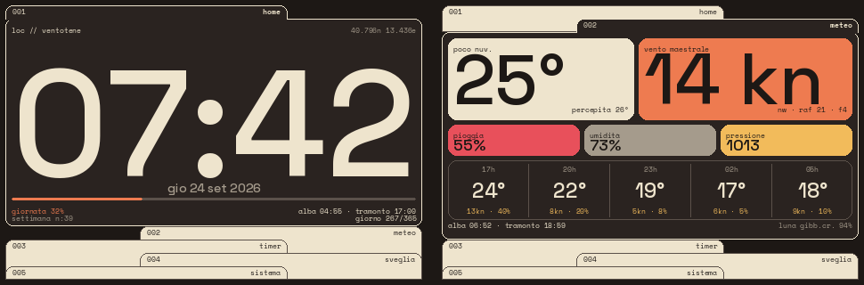

# pi-dash

Versione 0.1.0 · 2026-09-25

Dashboard da tavolo per Raspberry Pi 3 Model B con schermo SPI 3,5" touch: orologio, meteo e vento
in nodi, timer di partenza regata, sveglia e statistiche del sistema.



Le pagine sono le cartelle di uno schedario: si tocca la linguetta numerata e la cartella si apre
sotto di essa. Stesso stile ovunque — pannelli arrotondati a colori su fondo scuro, numeri in
Space Grotesk, microetichette in Space Mono.

## 1. Pagine
| # | Pagina | Contenuto |
|---|---|---|
| 001 | Home | ora, data, luogo e coordinate, alba/tramonto, barra della giornata, settimana n:X, giorno X/365 |
| 002 | Meteo | temperatura, vento con raffiche e Beaufort, pioggia, umidità, pressione, previsione oraria, sole e luna |
| 003 | Timer | conto alla rovescia con preset (5' = sequenza di partenza) |
| 004 | Sveglia | prossima sveglia, stato, elenco per giorno della settimana |
| 005 | Sistema | CPU, RAM, disco, storico CPU, host, IP, temperatura, uptime |

Dati meteo: [Open-Meteo](https://open-meteo.com), senza chiave. Alba e tramonto della Home sono
calcolati in locale: funzionano anche senza rete.

## 2. Hardware
| Voce | Dato |
|---|---|
| Scheda | Raspberry Pi 3 Model B, Raspberry Pi OS Lite 64 bit |
| Schermo | "3.5inch RPi Display" 480×320, ILI9486 + touch XPT2046 (overlay `piscreen,drm`) |
| Alimentatore | 5,1 V 2,5 A |
| Opzionali | pulsanti su GPIO 5/13/19, cicalino su GPIO 26 |

Pin e vincoli: [docs/hardware.md](docs/hardware.md).

## 3. Installazione
Guida passo passo, anche per chi non ha mai usato un Raspberry:
[docs/installazione.md](docs/installazione.md).

```
sudo apt install -y git python3-venv python3-pil
git clone https://github.com/UTENTE/pi-dash.git ~/pi-dash
cd ~/pi-dash
python3 -m venv --system-site-packages .venv
.venv/bin/pip install -r requirements.txt
.venv/bin/python -m dash --once --demo --driver sim   # prova: scrive out/frame.png
```

## 4. Configurazione
Tutto in `config.json`: posizione, sveglie, preset del timer, pagine, colori, touch.
Le voci e la calibrazione del tocco sono spiegate nella guida (§ 5.4 e § 9).

## 5. Sviluppo senza hardware
```
python -m dash --demo --driver sim --web 8080   # simulatore nel browser
python -m unittest -v                           # 35 test
```
Regole del progetto e decisioni: [CLAUDE.md](CLAUDE.md). Modifiche: [CHANGELOG.md](CHANGELOG.md).

## 6. Font
Space Grotesk e Space Mono: SIL Open Font License 1.1 (licenze in `fonts/`).
